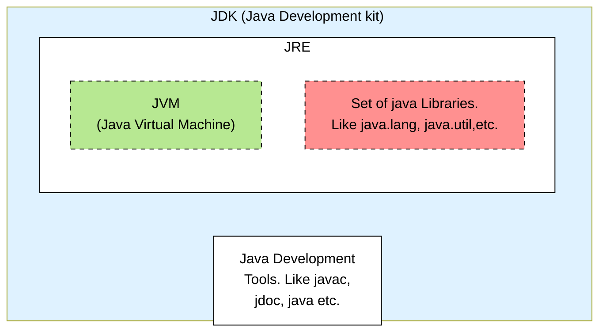
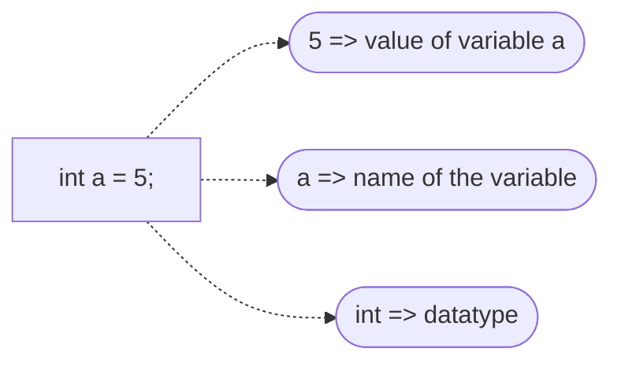
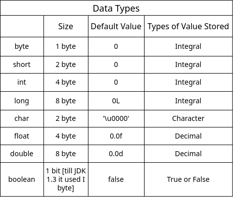

## Files Extensions
`.java [sourcecode]` and `.class [bytecode]`

## JDK VS JVM VS JRE




`JDK`  : it includes JRE, interpreter/loader (java), javac javadoc, and other tools needed for Java Development. Essentially, JDK is superset of JRE.

`JRE` : it is a part of JDK, but can be downloaded seprately. Provides libraries, the JVM, and other components to run application.

`JVM` : its a part of JRE and is responsible for executing the bytecode. "WORA" capability. Not platform independent.


## Print Statements
- `print("one")` : prints is one line, uses no new line
- `println("two")` : first prints then goes to a new line
- `println()` : will print a new line

For Example => 
```java
public class PrintStatement {
    public static void main(String[] args) {
        System.out.print("one");
        System.out.println();
        System.out.print("two");
        System.out.println("three");
        System.out.print("four");
    }

}
```

```bash
$output
one
twothree
four
```

## Importance of the main method
- Enrty point : it's the entry point of a Java program,
where the execution starts. JVM looks for main method.
- public and static : main method must be accessible to jvm without needing to instantiate the class.
- fix signature => public static void main(String[] args)

## What are variables?
- Variables are like containers used for storing data values.

- You can see here a variable `int a` has value `5`;
- It has integer datatype [will discuss about this later]
- For now integer has 4 bytes (32 bits) of size in java, so JVM will allocate 4 bytes for the variable a onto stack.
- Variable name does not gets stored onto the stack.
- There is a concept of address on the memory.

## Data Types



In the table above you can see different different types of datatypes that are used in java.

```mermaid
flowchart TB
    id1(Java DataTypes) ---> A["Primitive Data Types"] & B["Non Primitive Data Types"]
    A .-> C["Boolean"] & D["Numeric"]
    B .-> E["strings"] & F["arrays"] & G["objects"]
    C .-> H["boolean"]
    D .-> I["Character"] & J["Integral"]
    I .-> K["char"]
    J .-> L["Integer"] & M["Floating Point"]
    L .-> N["byte"] & O["short"] & P["int"] & Q["long"]
    M .-> R["float"] & S["double"]


