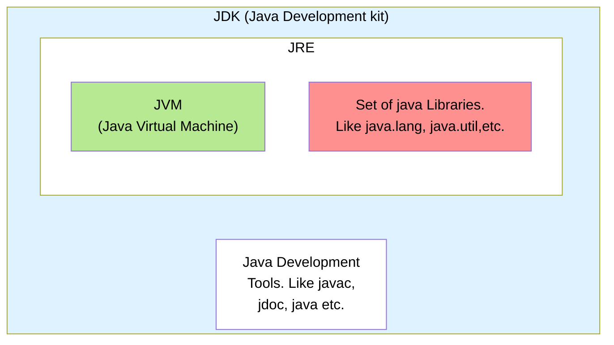

## Files Extensions
`.java [sourcecode]` and `.class [bytecode]`

## JDK VS JVM VS JRE

###### `JDK`  : it includes JRE, interpreter/loader (java), javac javadoc, and other tools needed for Java Development. Essentially, JDK is superset of JRE.

###### `JRE` : it is a part of JDK, but can be downloaded seprately. Provides libraries, the JVM, and other components to run application.

###### `JVM` : its a part of JRE and is responsible for executing the bytecode. "WORA" capability. Not platform independent.